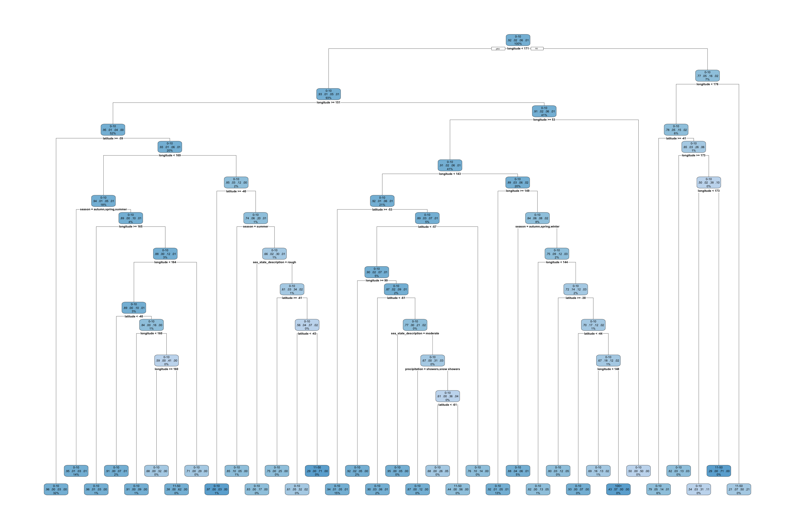

# Introduction {background-color="#2c3e50"}

## Exploring the Data
- **Source:** TidyTuesday (April 14, 2026).
- **Context:** Observations of birds at sea, climate, and quantity of ships at sea during 10-minute port intervals.
- **Goal:** Understand geographic distribution and predict flock sizes based on environmental factors.

```{r}
#| label: setup
#| echo: false
library(tidyverse)
library(gtsummary)
library(maps)
library(dbscan)
library(caret)
library(pROC)
library(rpart)
library(rpart.plot)
library(pheatmap) #for confusion matrix

tuesdata <- tidytuesdayR::tt_load('2026-04-14')

beaufort_scale <- tuesdata$beaufort_scale
birds <- tuesdata$birds
sea_states <- tuesdata$sea_states
ships <- tuesdata$ships


# merge ship and sea data 
ships <- ships %>%
  left_join(beaufort_scale, by = "wind_speed_class") %>%
  left_join(sea_states, by = "sea_state_class") %>%
  mutate(date = as.Date(date),
         year = year(date),
         month = month(date))

# merge birds with ship and sea data
df <- birds %>%
  left_join(ships, by = "record_id")

```

```{r}
#| label: cleaning
#| echo: false

df_clean <- df %>%
  filter(!is.na(count)) %>% # these are variables we definitely want to use, so filter out observations that are missing these. species common name has the fewest missing obs of the three different types of species name columns. doing them in separate lines because the or command wasn't working correctly for some reason
  filter(!is.na(latitude)) %>%
  filter(!is.na(longitude)) %>%
  filter(!is.na(year)) %>%
  filter(!is.na(month)) %>%
  filter(!is.na(species_common_name)) %>% 
  select(where(~ mean(is.na(.)) <= 0.6)) %>% 
  filter(rowMeans(is.na(.)) <= 0.6) %>%
  select(where(~ mean(is.na(.)) <= 0.2)) %>%
  filter(rowMeans(is.na(.)) <= 0.0) 

# see where we're at after removing some things 
missing_summary_cleaned_df <- df_clean %>%
  summarise(across(everything(), ~ mean(is.na(.)))) %>%
  pivot_longer(cols = everything(),
               names_to = "column",
               values_to = "prop_missing") %>%
  arrange(desc(prop_missing))

```

```{r}
#| label: making some new variables
#| echo: false

# species column has a LOT of species that are observed very few times. going to make a new variable that collapses rare ones into one "other" column
df_clean <- df_clean %>%
  group_by(species_common_name) %>%
  mutate(species_count = n()) %>%
  ungroup() %>%
  mutate(species_simplified = case_when(
    species_count/nrow(df_clean) >= 0.01 ~ species_common_name,
    TRUE ~ "other"
  )) %>%
  select(-species_count)


# this still has a lot of unique birds. it may be better to do family level
# also calculate log counts since bird is skewed
# and group rare weather events because they're too infrequent to be statistically useful 
# also format strings for visualization purposes 
birds_clean <- df_clean %>%
  mutate(species_family = case_when(
    str_detect(species_common_name, "albatross|mollymawk") ~ "Albatross",
    str_detect(species_common_name, "petrel|shearwater|prion|fulmar|diving-petrel") ~ "Petrel/Shearwater/Prion",
    str_detect(species_common_name, "gull|tern|noddy") ~ "Gull/Tern",
    str_detect(species_common_name, "skua|jaeger") ~ "Skua/Jaeger",
    str_detect(species_common_name, "penguin") ~ "Penguin",
    str_detect(species_common_name, "gannet|booby") ~ "Gannet/Booby",
    str_detect(species_common_name, "cormorant|shag") ~ "Cormorant/Shag",
    str_detect(species_common_name, "frigatebird|tropicbird") ~ "Frigatebird/Tropicbird",
    TRUE ~ "Unidentified/Other"
  ),
    species_family = factor(species_family, levels = c("Albatross", "Petrel/Shearwater/Prion", "Gull/Tern", "Skua/Jaeger", "Penguin", "Gannet/Booby", "Cormorant/Shag", "Frigatebird/Tropicbird", "Unidentified/Other")),
    
    # calculate log counts and intervals for individual observations
    log_count = log10(count + 1),
    species_bird_interval = cut(count, 
                                breaks = c(-Inf, 10, 50, 100, Inf), 
                                labels = c("0-10", "11-50", "51-100", "100+"),
                                ordered_result = TRUE),
    
    # group rare weather events
    precip_grouped = case_when(
      precipitation == "none" ~ "None",
      precipitation %in% c("rain", "showers", "drizzle") ~ "Rain/Showers",
      precipitation %in% c("continuous snow", "snow showers", "fog", "squalls") ~ "Harsh Weather",
      TRUE ~ "Unknown"
    ),
    precip_grouped = factor(precip_grouped, levels = c("None", "Rain/Showers", "Harsh Weather", "Unknown")),
    
    # format strings for visualization
    season = str_to_title(season),
    precipitation = str_to_title(precipitation),
    cloud_cover = str_to_title(cloud_cover),
    sea_state_description = str_to_title(sea_state_description)
  ) 

```

```{r}
#| label: session aggregation
#| echo: false

# aggregate data to the session level
session_data <- birds_clean %>%
  group_by(record_id) %>%
  summarize(
    total_birds = sum(count, na.rm = TRUE),
    any_following_ship = any(following_ship == TRUE, na.rm = TRUE),
    
    # keep constant environmental variables
    latitude = first(latitude),
    longitude = first(longitude),
    season = first(season),
    cloud_cover = first(cloud_cover),
    sea_state_description = first(sea_state_description),
    wind_description = first(wind_description),
    wind_speed_class = first(wind_speed_class),
    precipitation = first(precipitation),
    precip_grouped = first(precip_grouped),
    .groups = 'drop'
  ) %>%
  mutate(
    birds_present = ifelse(total_birds > 0, "Yes", "No"),
    following_ship_cat = ifelse(any_following_ship, "Yes", "No"),
    bird_interval_four = cut(total_birds, 
                        breaks = c(-Inf, 10, 50, 100, Inf), 
                        labels = c("0-10", "11-50", "51-100", "100+"),
                        ordered_result = TRUE),
    bird_interval_two = cut(total_birds,
                            breaks = c(-Inf, 50, Inf),
                            labels = c("0-50", "51+"),
                            ordered_result = TRUE),
    bird_interval_present = cut(total_birds,
                            breaks = c(-Inf, 1, Inf),
                            labels = c("Solo bird", "Flock (2+ Birds)"),
                            ordered_result = TRUE)
  )
```

# Data Familiarization 

## Key variables

- Original outcome: Number of birds observed in an observation session 
- Updated outcome: Whether a flock of birds is present (as opposed to one bird)

- Predictors: Climate (e.g., cloud, sea state, precipitation) & location

## Data cleaning

Went from 49,019 observations of 54 variables to 23,382 observations of 40 variables. 

Iterative cleaning process:

1. Remove columns missing > 60% observations 

2. Remove rows missing > 60% variables 

3. Remove columns missing > 20% observations

4. Remove rows missing > 20% variables

5. Remove columns missing any observations

## Feature Engineering: Collapsing Variables

- Bird Species -> Families
- Rare weather events -> Overall weather conditions 
- Bird count -> Bird count interval

```{r}
#| label: bird grouping
#| echo: false

# session interval frequency
session_data %>%
  select(bird_interval_four) %>%
  tbl_summary(
    label = list(bird_interval_four ~ "Total Bird Count Interval (Session)"),
    statistic = list(all_categorical() ~ "{n} ({p}%)")
  ) %>%
    as_gt() %>%
  gt::tab_caption("Table 1. Distribution of Bird Count Intervals")

```
## Feature Engineering: Differing Intervals of Bird Counts

We looked at bird count by observations of each bird family within a session and by overall birds observed within a session.

```{r}
#| label: not aggregate frquency table 
#| echo: false 


# observation interval frequency
birds_clean %>%
  select(species_bird_interval) %>%
  tbl_summary(
    label = list(species_bird_interval ~ "Total Bird Count Interval (Species Observation)"),
    statistic = list(all_categorical() ~ "{n} ({p}%)")
  ) %>%
 as_gt() %>%
  gt::tab_caption("Table 2. Distribution of Per-Family Bird Count Intervals")


# solo vs flock interval frequency
session_data %>%
  select(bird_interval_present) %>%
  tbl_summary(
    label = list(bird_interval_present ~ "Total Bird Count Interval (Solo vs. Flock)"),
    statistic = list(all_categorical() ~ "{n} ({p}%)")
  ) %>%
    as_gt() %>%
  gt::tab_caption("Table 3. Distributions of Solo Bird v.s. Flock Counts")


```

## Data Overview 

```{r}
#| label: summary-table
#| echo: false 

birds_clean %>%
  select(`Bird Family` = species_family, `Bird count` = count, Season = season, 
         `Cloud cover` = cloud_cover, Precipitation = precip_grouped, 
         `Number of birds feeding` = feeding, `Number of birds flying past` = flying_past, 
         `Number of birds following ships` = following_ship, 
         `Sea state` = sea_state_description, Longitude = longitude, Latitude = latitude) %>%
  tbl_summary(
    statistic = list(all_continuous() ~ "{mean} ({sd})", all_categorical() ~ "{n} ({p}%)"),
    missing = "ifany"
  ) %>%
  as_gt() %>%
  gt::tab_caption("Table 4. Summary of bird observations")

```

# Exploratory Analysis 

## Spatial distribution

We see many more large counts around New Zealand and Australia, but...

```{r}
#| label: mapping of bird intervals
#| echo: false 
world_map <- map_data("world")

# spatial map of intervals
ggplot() +
  geom_polygon(data = world_map, aes(x = long, y = lat, group = group), fill = "lightgray", color = "white") +
  geom_point(data = session_data %>% arrange(bird_interval_four), 
             aes(x = longitude, y = latitude, color = bird_interval_four), size = 1.5, alpha = 0.8) +
  scale_color_brewer(palette = "YlOrRd", name = "Bird Count\nInterval") +
  theme_minimal() +
  labs(title = "Geographic Distribution of Bird Count Intervals", x = "Longitude", y = "Latitude") +
  coord_quickmap(xlim = c(40, 200), ylim = c(-90, 0))

```

## Spatial Density of Observations  

... We also see many more observations around New Zealand and Australia

```{r}
#| echo: false
ggplot() +
  geom_polygon(data = world_map, aes(x = long, y = lat, group = group), fill = "lightgray") +
  geom_density_2d(data = birds_clean, aes(x = longitude, y = latitude), color = "blue") +
  theme_minimal() + coord_quickmap(xlim = c(40, 200), ylim = c(-90, 0))
```


## Spatial Clustering (DBSCAN) 

Using DBSCAN to identify high-density sighting regions ($\epsilon = 3$, $minPts = 5$). 

This may reflect the density of observations problem.

```{r}
#| label: dbscan
#| echo: false

coords <- session_data %>% select(longitude, latitude)
db_res <- dbscan(coords, eps = 3, minPts = 5)
session_data$cluster <- as.factor(db_res$cluster)

ggplot() +
  geom_polygon(data = world_map, aes(x = long, y = lat, group = group), fill = "lightgray") +
  geom_point(data = session_data, aes(x = longitude, y = latitude, color = cluster), size = 1) +
  scale_color_viridis_d(name = "Cluster") +
  theme_minimal() + coord_quickmap(xlim = c(40, 200), ylim = c(-90, 0))
```


## Activity Frequency 

```{r}
#| label: bird activity 
#| fig-cap: Frequency of observed bird activities across all observation sessions. 
#| echo: false

# frequency of activities
activity_cols <- c("feeding", "sitting_on_water", "sitting_on_ice", "sitting_on_ship", "in_hand", "flying_past", "accompanying", "following_ship", "naturally_feeding")

birds_clean %>%
  select(all_of(activity_cols)) %>%
  pivot_longer(cols = everything(), names_to = "activity_type", values_to = "is_doing") %>%
  filter(is_doing == TRUE) %>%
  mutate(activity_type = str_to_title(str_replace_all(activity_type, "_", " "))) %>%
  ggplot(aes(x = fct_infreq(activity_type))) +
  geom_bar(fill = "red4", color = "black", alpha = 0.8) +
  coord_flip() + 
  theme_minimal() +
  labs(title = "Frequency of Observed Bird Activities", x = "Activity Type", y = "Total Occurrences")

```

## Seasonality and Bird Counts

```{r}
#| label: by season
#| echo: false


# by season 
ggplot(session_data, aes(x = season, fill = bird_interval_four)) +
  geom_bar(position = "fill") +
  theme_minimal() +
  scale_fill_brewer(palette = "YlOrRd") +
  labs(title = "Proportion of Bird Count Intervals by Season",
       x = "Season", y = "Proportion", fill = "Bird Count Interval")
```

# Modeling 

## Logistic Regression: Flock vs. Solo bird

Predicting if more than one bird will be present (Model 1)

Area under the curve: 0.6384
```{r}
#| label: bird appearance binary variable
#| echo: false
#| warning: false 
#| message: false

# create a new variable that is a binary of whether or not there is a bird
df_logistic <- birds_clean %>%
  mutate(birds = case_when(count > 1 ~ "X1",
                           count <= 1 ~ "X0"))

# filter variables
df_logistic <- df_logistic %>%
    select(
    species_family,
    birds,
    season,
    cloud_cover, precipitation,
    feeding, flying_past, following_ship,
    sea_state_description,
    longitude,
    latitude
  ) %>%
mutate(cloud_cover = factor(cloud_cover, levels = c(
    "Clear", "Partially Cloudy", "Overcast"
  ))) %>%
  mutate(sea_state_description = factor(sea_state_description, levels = c(
    "Calm, Rippled", "Smooth", "Slight", "Moderate", "Rough", "Very Rough"
  ))) %>%
  mutate(birds = factor(birds))

#summary(df_logistic$birds)
# set seed
set.seed(244)
# split into test/ train for CV
test1_id <- sample(1:nrow(df_logistic), size= nrow(df_logistic) * .25)
train1 <- df_logistic[-test1_id,]
test1 <- df_logistic[test1_id,]
# set up control for classification
ctrl <- trainControl(method = "cv",
                     number = 10,
                     classProbs = TRUE,
                     summaryFunction = twoClassSummary)
# train model
lr_1 = train(
  form = birds ~ season + cloud_cover + sea_state_description +
    precipitation + species_family + longitude + latitude +
    feeding + flying_past + following_ship,
  data = train1,
  method = "glm",
  family = "binomial",
  metric = "ROC",
  trControl = ctrl)
#lr_1
# test model
test1_pred <- predict(lr_1, newdata = test1)
test1_prob <- predict(lr_1, newdata=test1, type= "prob")
# make confusion matrix
cm1 <- confusionMatrix(data = test1_pred, reference=test1$birds)
#cm1
# AUC
roc1 <- roc(test1$birds, test1_prob$X0)
#auc(roc1)
# plot curve
ggroc(roc1, legacy.axes = TRUE) + #set axes to 1-specificity vs sensitivity
  geom_abline(intercept = 0, slope = 1, linetype = "dashed", color = "red") + #AUC = 0.5
  labs(
    title = "ROC Curve of Model 1",
    x= "1 - specificity",
    y= "sensitivity") + 
  theme_minimal()
```

## Logistic Regression: Flock size (> 50 birds)

Predicting whether a flock has more than 50 birds (Model 2)

Area under the curve: 0.5815

```{r}
#| label: aggregated data model
#| echo: false
#| message: false
#| warning: false

# code the bird_interval_two variable as a factor variable for logistic regression
lr2_data <- session_data %>% 
  mutate(birds = case_when(bird_interval_two == "0-50" ~ "X0",
                           bird_interval_two == "51+" ~ "X1")) %>%
  select(birds, latitude, longitude,
         sea_state_description, 
         wind_description, precipitation, season, cloud_cover) %>%
  mutate(birds = factor(birds))
#note: aggregated data is missing a lot of potential predictor variables

# set seed
set.seed(244)
# split into test/ train for CV
test2_id <- sample(1:nrow(lr2_data), size= nrow(lr2_data) * .25)
train2 <- lr2_data[-test2_id,]
test2 <- lr2_data[test2_id,]
# set up control for classification
ctrl <- trainControl(method = "cv",
                     number = 10,
                     classProbs = TRUE,
                     summaryFunction = twoClassSummary)
# train model
lr_2 = train(
  form = birds ~ .,
  data = train2,
  method = "glm",
  family = "binomial",
  metric = "ROC",
  trControl = ctrl)
#lr_2
# test model
test2_pred <- predict(lr_2, newdata = test2)
test2_prob <- predict(lr_2, newdata=test2, type= "prob")
# make confusion matrix
cm2 <- confusionMatrix(data = test2_pred, reference=test2$birds)
#cm2
# AUC
roc2 <- roc(test2$birds, test2_prob$X1)
#auc(roc2)
# plot curve
ggroc(roc2, legacy.axes = TRUE) + #set axes to 1-specificity vs sensitivity
  geom_abline(intercept = 0, slope = 1, linetype = "dashed", color = "red") + #AUC = 0.5
  labs(
    title = "ROC Curve of Model 2",
    x= "1 - specificity",
    y= "sensitivity") + 
  theme_minimal()
```

## Decision Tree: Flock Size

Classification of flock size saw high accuracy (0.921) by classifying nearly all observations into one flock.

```{r}
#| label: decision-tree
#| echo: false 
#| fig-height: 5
#| fig-cap: Modeling classification of bird counts into intervals (0-10, 11-50, 51-100, 100+).



```

```{r}
#| label: decision tree w confusion matrix
#| echo: false
#| warning: false
#| message: false

# filter data for tree-making
tree_data <- birds_clean %>%
  mutate(birds_four = case_when(count <= 10 ~ "0-10",
                                count <= 50 ~ "11-50",
                                count <= 100 ~ "51-100",
                                count > 100 ~ "100+")) %>%
  mutate(birds_four = factor(birds_four)) %>%
  select(birds_four,
    season,
    cloud_cover, precipitation,
    sea_state_description,
    longitude,
    latitude
  ) %>% 
  mutate(cloud_cover = factor(cloud_cover, levels = c(
    "clear", "partially cloudy", "overcast"
  ))) %>%
  mutate(sea_state_description = factor(sea_state_description, levels = c(
    "calm, rippled", "smooth", "slight", "moderate", "rough", "very rough"
  ))) 

# set seed
set.seed(244)
# test/train sets
test3_id <- sample(1:nrow(tree_data), size= nrow(tree_data)/2)
train3 <- tree_data[test3_id,]
test3 <- tree_data[-test3_id,]
# grow decision tree
bird_tree <- rpart(birds_four ~ ., data=test3, method="class", cp=0)
#plot tree & save as png
#png("bird_tree.png", width = 3000, height = 2000, res=300)
#rpart.plot(bird_tree, box.palette="Blues")
#dev.off()
#test error
test3_pred <- predict(bird_tree, newdata=test3, type="class")
# confusion matrix
cm3 <- table(test3_pred, test3$birds_four)
cm3 <- unclass(cm3)
names(cm3) <- paste("X", 1:4)
pheatmap(cm3, display_number = TRUE, number_color="white", main="Confusion Matrix of Decision Tree")
test3_error <- 1- (10766/11688)

```


# Conclusions

- Skewness: Bird counts are extremely right-skewed, requiring interval or binary classification.
- Geography: Sightings are highly clustered spatially, but this may be due to clustering of observation locations rather than true flock size trends.
- Environment: Climate and location likely play a role in bird presence, though AUC (~0.64) suggests high variance in sightings.

# Future Work

- Compare to more recent data (Sea Bird Tracking Database)
- Expand geographic area

